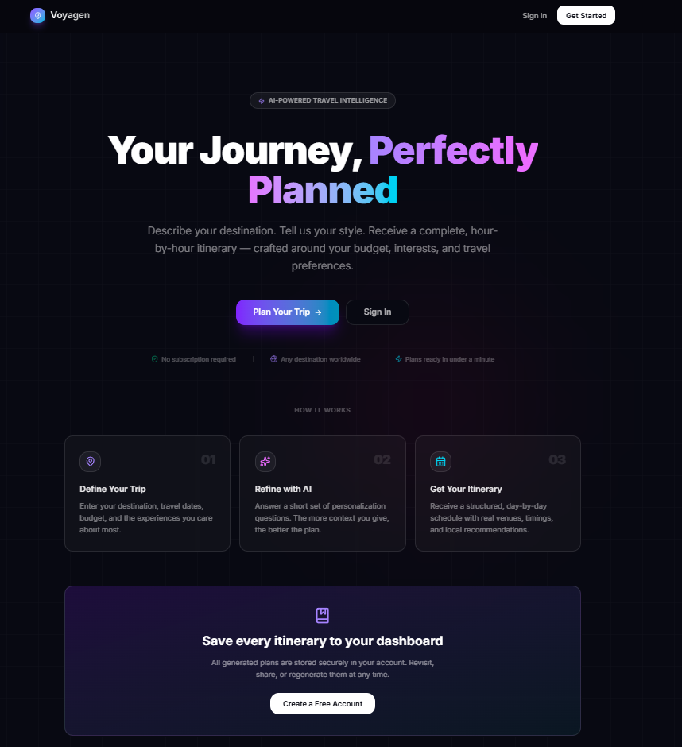
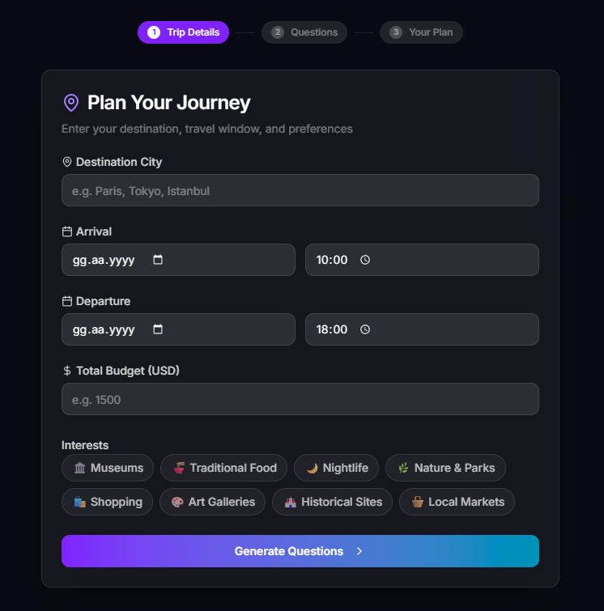
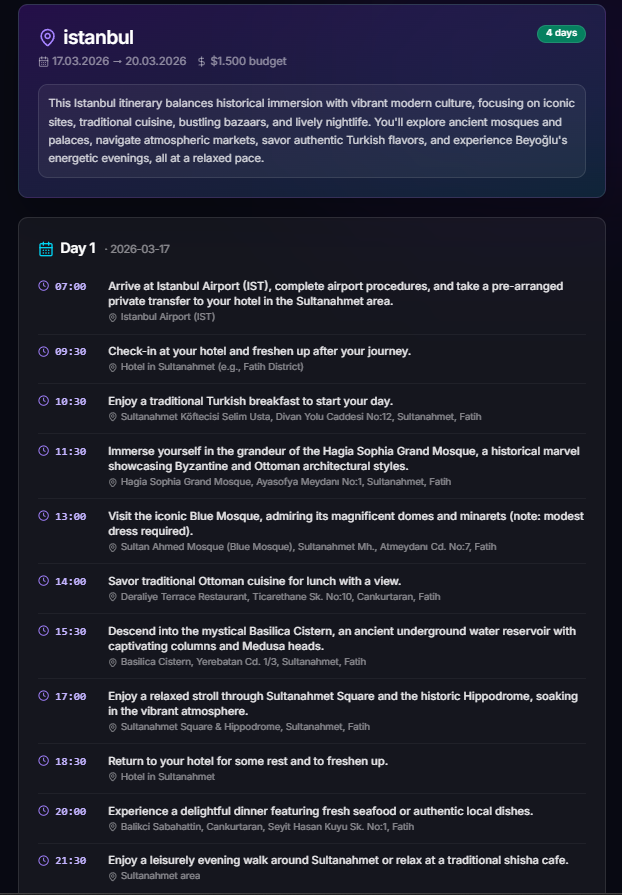
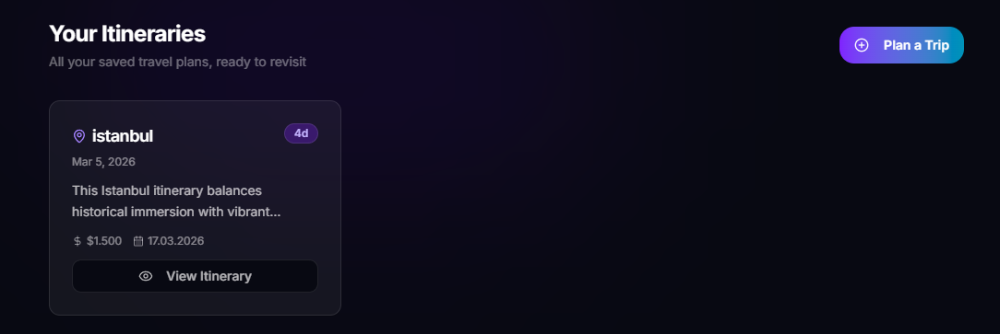

<div align="center">

# 🧳 Voyagen — AI Trip Planner

**An intelligent travel itinerary generator powered by Google Gemini.**  
Plan your perfect trip in minutes — personalized, day-by-day, hour-by-hour.

[](https://nextjs.org/)
[](https://www.typescriptlang.org/)
[](https://supabase.com/)
[](https://tailwindcss.com/)
[](https://deepmind.google/technologies/gemini/)

</div>

---

## 📸 Screenshots

<div align="center">

### Landing Page


### Planner — Trip Details


### Planner — AI-Generated Questions


### Planner — Day-by-Day Itinerary


</div>

---

## ✨ Features

- 🔐 **Authentication** — Secure sign up & login via Supabase Auth
- 🗺️ **Trip Setup** — Choose your destination, travel dates, budget, and interests
- 🤖 **AI Refinement** — Answer 5–10 yes/no questions so the AI personalizes your plan
- 📅 **Day-by-Day Itinerary** — Hourly schedule with real locations, restaurants & activities
- 💾 **Save & Revisit** — Save plans to your account and view them anytime
- 🔄 **Regenerate** — Not happy? Generate a new plan instantly

---

## 🖥️ Tech Stack

| Layer | Technology |
|---|---|
| Framework | [Next.js 15](https://nextjs.org/) — App Router |
| Language | [TypeScript](https://www.typescriptlang.org/) (strict mode) |
| Styling | [Tailwind CSS v4](https://tailwindcss.com/) + [shadcn/ui](https://ui.shadcn.com/) |
| Auth | [Supabase Auth](https://supabase.com/docs/guides/auth) |
| Database | [Supabase PostgreSQL](https://supabase.com/docs/guides/database) with RLS |
| AI Model | [Google Gemini 2.5 Flash](https://deepmind.google/technologies/gemini/) |
| Validation | [Zod](https://zod.dev/) |
| State | React `useReducer` + Next.js Route Handlers |

---

## 🚀 Getting Started

### Prerequisites

- Node.js 18+
- A [Supabase](https://supabase.com/) project
- A [Google AI Studio](https://aistudio.google.com/) API key

### 1. Clone the repository

```bash
git clone https://github.com/your-username/ai-trip-planner.git
cd ai-trip-planner
```

### 2. Install dependencies

```bash
npm install
```

### 3. Set up environment variables

Copy the example file and fill in your credentials:

```bash
cp .env.example .env.local
```

```env
NEXT_PUBLIC_SUPABASE_URL=your_supabase_project_url
NEXT_PUBLIC_SUPABASE_ANON_KEY=your_supabase_anon_key
SUPABASE_SERVICE_ROLE_KEY=your_supabase_service_role_key
GEMINI_API_KEY=your_gemini_api_key
```

> ⚠️ **Never commit `.env.local`** — it is excluded by `.gitignore`.

Where to get these values:
- **Supabase keys**: [Dashboard](https://supabase.com/dashboard) → Project → Settings → API
- **Gemini API key**: [Google AI Studio](https://aistudio.google.com/app/apikey)

### 4. Set up the database

Run the following SQL in your [Supabase SQL Editor](https://supabase.com/dashboard/project/_/sql):

```sql
create table public.plans (
  id uuid primary key default gen_random_uuid(),
  user_id uuid not null references auth.users(id) on delete cascade,
  city text not null,
  arrival_datetime timestamptz not null,
  departure_datetime timestamptz not null,
  budget integer not null,
  interests text[] not null,
  questions jsonb not null,
  plan jsonb not null,
  created_at timestamptz not null default now()
);

alter table public.plans enable row level security;

create policy "Users can view own plans"
  on public.plans for select using (auth.uid() = user_id);

create policy "Users can insert own plans"
  on public.plans for insert with check (auth.uid() = user_id);

create policy "Users can delete own plans"
  on public.plans for delete using (auth.uid() = user_id);
```

### 5. Configure Supabase Auth redirect URLs

In **Supabase → Authentication → URL Configuration**:
- **Site URL**: `http://localhost:3000`
- **Redirect URLs**: `http://localhost:3000/api/auth/callback`

### 6. Run the development server

```bash
npm run dev
```

Open [http://localhost:3000](http://localhost:3000) in your browser.

---

## 📁 Project Structure

```
├── app/
│   ├── (auth)/            # Login & Signup pages
│   ├── dashboard/         # Saved itineraries overview
│   ├── planner/           # Multi-step trip planner wizard
│   ├── plan/[id]/         # Individual saved plan view
│   └── api/               # Route Handlers (server-side only)
│       ├── auth/callback/ # Supabase OAuth callback
│       ├── questions/     # Gemini question generation
│       ├── plan/generate/ # Gemini itinerary generation
│       ├── plan/save/     # Save plan to Supabase
│       └── plans/         # Fetch user's saved plans
├── components/
│   ├── auth/              # LoginForm, SignupForm
│   ├── planner/           # StepTripDetails, StepQuestions, StepPlanView
│   └── shared/            # Navbar, LoadingSpinner
├── lib/
│   ├── supabase/          # Browser & server Supabase clients
│   ├── gemini.ts          # Gemini API wrapper (server-only)
│   ├── prompts.ts         # AI prompt templates
│   ├── validators.ts      # Zod schemas
│   └── utils.ts           # Tailwind class merge utility
├── types/
│   └── index.ts           # Shared TypeScript types & constants
├── assets/                # App screenshots
└── middleware.ts           # Auth route protection
```

---

## 🗺️ User Flow

```
Landing Page
    ↓
Sign Up / Log In  (Supabase Auth)
    ↓
Step 1: Enter destination, travel dates, budget & interests
    ↓
Step 2: Answer 5–10 AI-generated personalisation questions
    ↓
Step 3: View your personalised, day-by-day itinerary
    ↓
Save to dashboard  —or—  Regenerate a new plan
    ↓
Dashboard: browse & revisit all saved itineraries
```

---

## 🔒 Security

- All API keys live exclusively in `.env.local` — never bundled to the client
- `SUPABASE_SERVICE_ROLE_KEY` and `GEMINI_API_KEY` are only referenced in `lib/` and `app/api/`
- Every API route validates request bodies with **Zod** before processing
- **Row Level Security** (RLS) enforces that users can only read and write their own plans
- Protected routes (`/dashboard`, `/planner`, `/plan`) are guarded by `middleware.ts`

---

## 📄 License

This project is licensed under the [MIT License](LICENSE).

---

<div align="center">
  Made with ❤️ using Next.js &amp; Google Gemini
</div>
